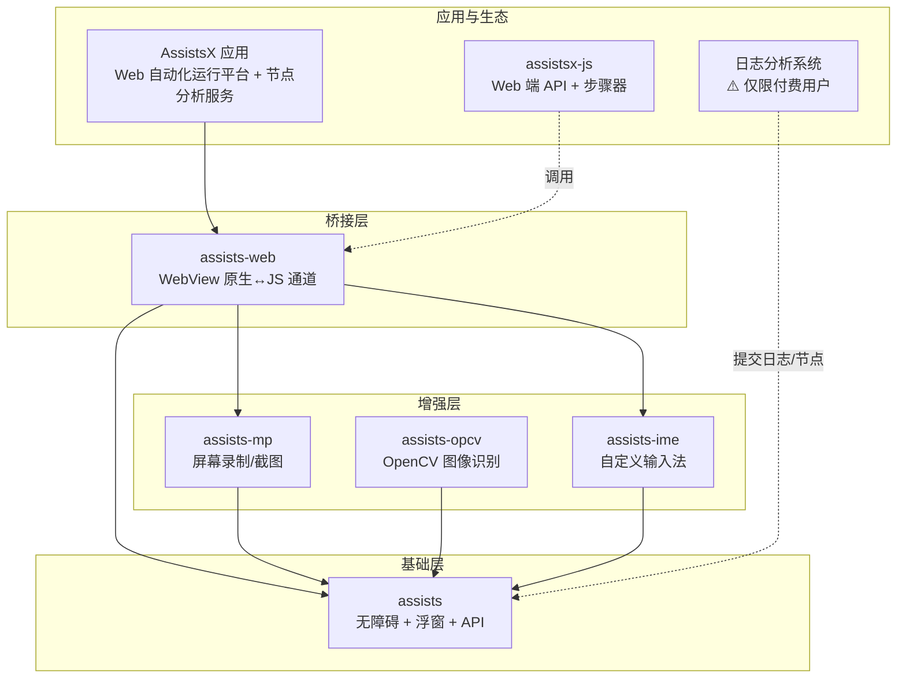
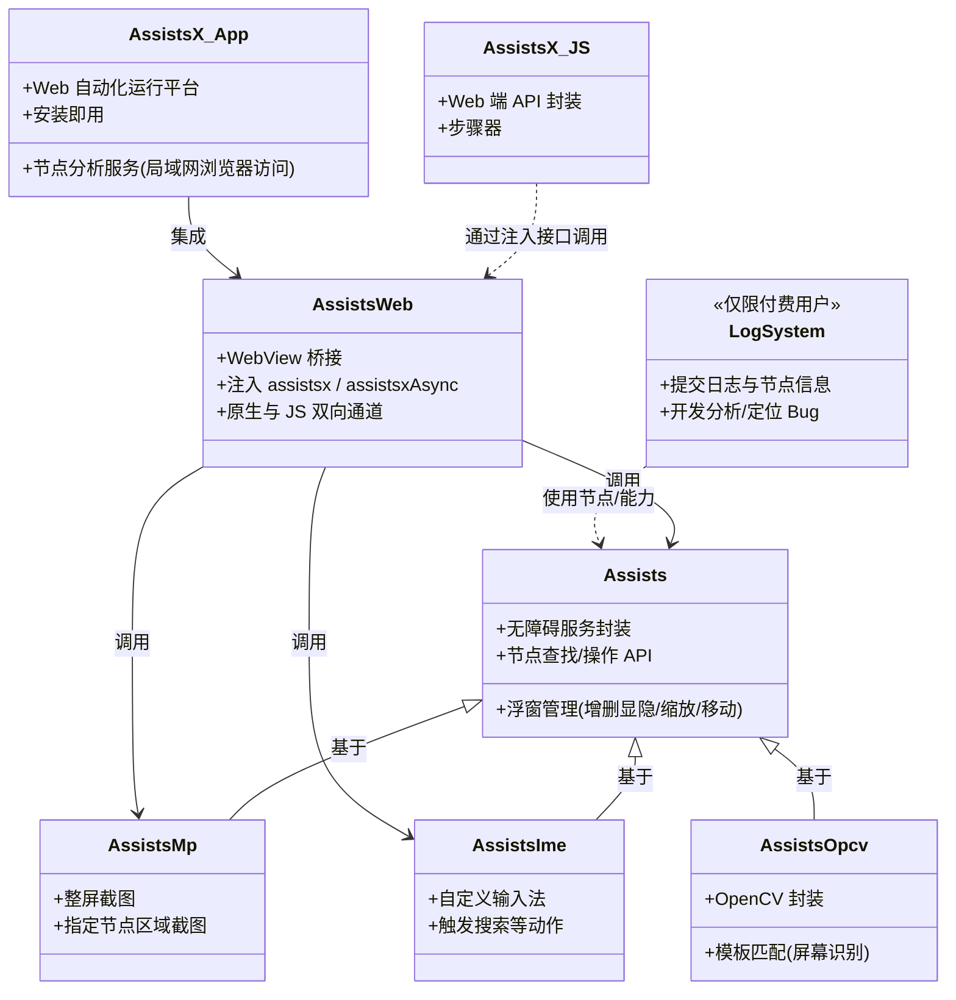
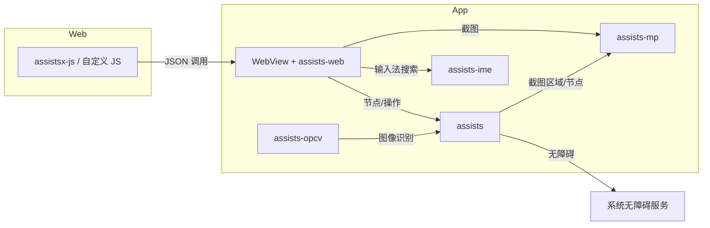

# 架构设计

本文档描述 Assists 自动化框架的整体架构、模块划分与依赖关系。该框架基于 **Android 无障碍服务**封装，提供节点查找、操作、浮窗、截图、输入法、Web 桥接等能力，并围绕 Web 自动化与日志分析形成完整开发生态。

---

## 一、概述

Assists 是一套**基于 Android 无障碍服务**封装的自动化框架，目标是通过统一的 API 与多种增强能力，支持在设备上完成 UI 自动化、脚本控制与 Web 端动态编排。核心特点包括：

- **基础层**：封装系统无障碍服务与能力增强 API，提供浮窗管理（添加/删除/显示/隐藏/缩放/移动）
- **增强层**：自定义输入法、屏幕截图、OpenCV 图像识别，弥补无障碍在部分场景的不足
- **桥接层**：WebView + JS 通道，使 Web 端可直接调用 Native 能力，实现「写 Web 即写自动化」
- **应用层**：Web 自动化运行平台 AssistsX、assistsx-js 步骤器、日志分析系统（**仅限付费用户使用**），支撑开发调试与问题定位

---

## 二、模块总览与依赖关系

### 2.1 模块依赖图（Mermaid）

### 2.2 模块一览表

| 模块 | 类型 | 职责 | 依赖 |
|------|------|------|------|
| **assists** | Library | 无障碍服务封装、能力增强 API、浮窗管理 | 无（基础） |
| **assists-ime** | Library | 自定义输入法，用于「仅输入法可触发搜索」等场景 | assists |
| **assists-mp** | Library | 屏幕录制与截图，整屏/节点截图，弥补无障碍无法直接截图的场景 | assists |
| **assists-opcv** | Library | OpenCV 封装，当前以模板匹配做屏幕识别增强 | assists |
| **assists-web** | Library | WebView 桥接，原生与 JS 双向通道，暴露 assists 能力给 Web | assists, assists-mp, assists-ime |
| **AssistsX** | App | Web 自动化运行平台，安装于手机，开发者专注 Web 开发自动化；支持节点分析工具（局域网浏览器访问，分析当前页面节点） | assists-web（及底层库） |
| **assistsx-js** | JS 库 | Web 端 API 封装 + 步骤器，便于开发与维护大型自动化 | 通过 assists-web 注入的接口调用 |
| **日志分析系统** | 系统能力 | 测试提交日志与页面节点信息，供开发分析、精准定位多设备/多界面 Bug。**⚠️ 仅限付费用户使用** | 与 assists 能力配合 |

---

## 三、各模块说明

### 3.1 assists（基础框架）

- **定位**：整个框架的基础库，所有增强与桥接均基于此构建。
- **核心能力**：
  - **无障碍服务封装**：连接系统 AccessibilityService，提供节点树获取、查找（按 id/text/class 等）、点击、长按、输入、滚动等标准能力。
  - **能力增强 API**：在系统无障碍之上做封装与扩展，便于上层统一调用。
  - **浮窗管理**：浮窗的添加、删除、显示、隐藏，以及浮窗的**缩放、移动**，可快速实现悬浮控制面板、小窗等 UI。
- **依赖**：仅依赖 Android SDK 与通用工具库，不依赖其他 Assists 子模块。
- **发布**：Maven 产物为 `assists-base`（如 `com.github.ven-coder:assists:assists-base`）。

### 3.2 assists-ime（自定义输入法）

- **定位**：为 assists 提供输入法维度的增强，主要解决「页面无搜索按钮、仅能通过输入法触发搜索」等场景。
- **主要作用**：在搜索框获得焦点后，通过自定义输入法的「搜索/提交」等动作触发搜索，供 assists 自动化流程调用。
- **依赖**：依赖 **assists**，作为 assists 的扩展能力被使用；**assists-web** 也依赖 assists-ime，以便在 Web 自动化中调用该能力。

### 3.3 assists-mp（屏幕录制与截图）

- **定位**：屏幕内容截图与录制库，用于增强 assists 在「图像」维度的能力。
- **核心能力**：
  - **整屏截图**：对整个屏幕进行截图，弥补无障碍服务无法直接截取屏幕画面的限制。
  - **指定节点区域截图**：结合 assists 的节点信息（如 bounds），对指定控件区域截图，便于做局部识别或上报。
- **使用场景**：当无障碍无法直接拿到屏幕像素（如部分游戏、视频、安全界面）时，作为补充方案；也可为模板匹配、OCR 等提供图像输入。
- **依赖**：依赖 **assists**；**assists-web** 依赖 assists-mp，从而在 Web 端可调用截图相关 API。

### 3.4 assists-opcv（OpenCV 图像识别）

- **定位**：集成并封装 OpenCV，增强**图片处理与识别**能力，当前主要用作屏幕识别的补充手段。
- **当前实现**：以**模板匹配**为主，在屏幕或截图上做模板匹配，用于辅助定位目标区域，增强 assists 的「找控件/找区域」能力。
- **建议**：更复杂的识别需求（如复杂 OCR、多目标、鲁棒性要求高）建议评估其他方案（如 ML Kit、自研模型等），本库可作为轻量增强与尝试入口。
- **依赖**：依赖 **assists**，与 assists、assists-mp 配合使用（例如对 assists-mp 的截图做模板匹配）。

### 3.5 assists-web（WebView 桥接）

- **定位**：封装 WebView，建立**原生与 JS 的双向通道**，使 Web 页面可直接调用 assists 的无障碍及增强能力，实现「用 Web + JS 写自动化」。
- **核心能力**：
  - 向 WebView 注入约定对象，前端通过 JSON 调用指定 method。
  - 支持在同一个 App 内加载本地或远程 Web 页面，动态编写、更新自动化逻辑，无需重新发版。
- **依赖**：**assists**（核心）、**assists-mp**（截图）、**assists-ime**（输入法触发搜索等）
- **与 assistsx-js 的关系**：assists-web 提供「能力注入与协议」，assistsx-js 在 Web 端封装成易用 API 并实现步骤器，二者配合完成完整的 Web 自动化开发体验。

---

## 四、Web 自动化生态

### 4.1 assistsx-js（Web 端 API + 步骤器）

- **定位**：面向 Web 自动化开发的 **JavaScript 库**，运行在加载了 assists-web 的 WebView 页面中。
- **作用**：
  - **API 封装**：将 assists-web 注入的原始接口封装成更易用的 API，开发时直接调用即可驱动 assists 完成查找、点击、输入等操作。
  - **步骤器**：提供步骤编排与维护能力，便于**开发与维护大型自动化程序**（步骤拆分、复用、错误处理等）。
- **使用方式**：在 Web 自动化页面中集成 assistsx-js，通过其 API 调用底层 assists 能力；无需关心底层 JSON 协议细节。
- **推荐**：使用 **Web 实现自动化** 可带来**调试快、动态更新**等优势，适合作为主要自动化开发方式。

### 4.2 AssistsX（Web 自动化运行平台）

- **定位**：基于 **assists-web** 实现的 **Android 应用**，即「Web 自动化运行平台」。
- **作用**：安装在手机上后，开发者只需专注于**使用 Web 技术开发自动化**，无需单独开发、安装自己的 App；AssistsX 负责提供 WebView 环境、注入 assists 能力、加载并执行用户的 Web 自动化页面。
- **节点分析工具**：AssistsX 支持**节点分析服务**能力。开启后，可在**局域网**内通过**浏览器**访问该服务，实时查看与分析当前手机界面上的**页面节点**（节点树、属性等），便于编写或调试自动化脚本时快速定位控件。
- **下载**：[AssistsX](https://www.pgyer.com/SqGaCx8C)（版本等信息以页面为准）。
- **关系**：AssistsX App → 依赖 assists-web → 依赖 assists / assists-mp / assists-ime；Web 端再配合 assistsx-js 使用，形成「手机端运行环境 + Web 端开发与步骤编排」的闭环。

---

## 五、日志分析系统

> **⚠️ 仅限付费用户使用**  
> 日志分析系统为付费/商业扩展功能，仅对已获得相应许可的付费用户使用。

- **定位**：面向**测试与开发协作**的支撑能力，用于解决「出现 Bug 时缺少日志与页面节点信息、在不同设备/界面上难以复现与定位」的痛点。
- **主要能力**：
  - **测试人员**：可提交**运行日志**与**当前页面的节点信息**（如节点树、控件属性、截图等），便于开发还原现场。
  - **开发人员**：基于提交的日志与节点信息分析页面结构，快速精准定位问题，减少「无法复现」「设备差异」带来的排查成本。
- **与框架关系**：与 **assists** 能力配合（如通过 assists 获取节点树、通过 assists-mp 获取截图），可集成在 AssistsX 或自研 App 中，作为自动化测试与问题排查的配套功能。

---

## 六、架构层次与类图（模块级）

以下用 Mermaid 的 `classDiagram` 从「模块/包」视角描述各部分的职责与关系（非具体 Java/Kotlin 类）。

---

## 七、数据流与调用关系简图

